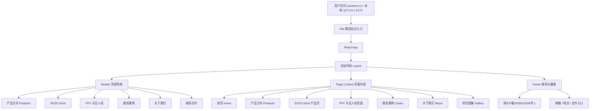
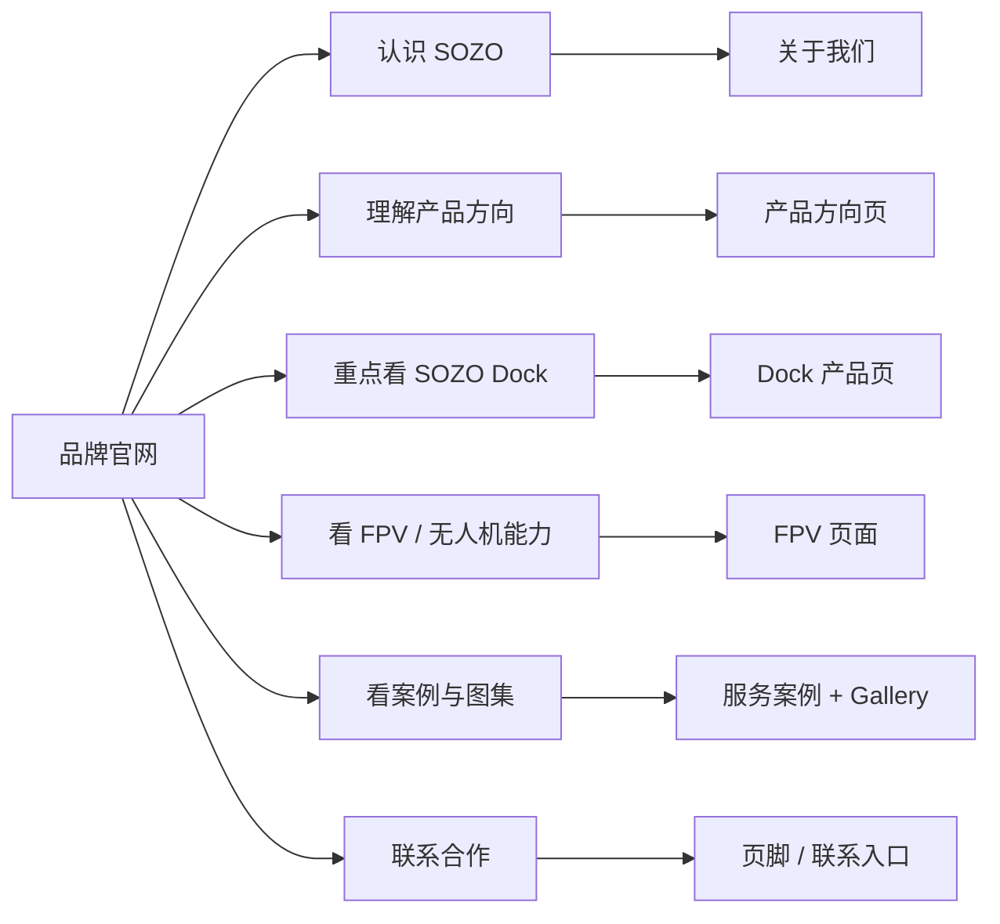
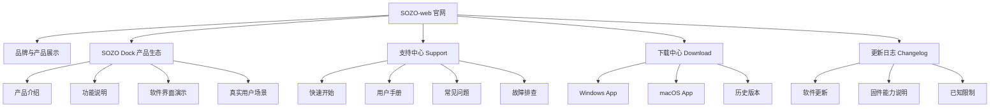

# SOZO-web 网页逻辑拓扑

本文档记录 SOZO Tech 官网当前的页面组织、内容流向和后续扩展方向，用于后续设计、开发、上线和维护时保持结构清晰。

## 1. 当前站点访问逻辑

## 2. 当前多页面内容结构

```mermaid
flowchart TD
    P1["首页 Home"] --> C1["品牌入口 / 主视觉"]
    P1 --> C2["业务方向入口"]
    P1 --> C3["精选项目"]
    P1 --> C4["联系入口"]

    P2["产品方向 Products"] --> D1["产品路线"]
    P2 --> D2["SOZO Dock / FPV / 工程工具 / 创客教育"]
    P2 --> D3["工程方法"]
    P2 --> D4["联系入口"]

    P3["SOZO Dock"] --> Dock1["Dock 主视觉"]
    P3 --> Dock2["灯效 / 敲击 / 电脑控制 / 音频律动"]
    P3 --> Dock3["硬件系统"]
    P3 --> Dock4["开发状态"]
    P3 --> Dock5["软件与文档入口预留"]

    P4["FPV 与无人机"] --> FPV1["FPV 主视觉"]
    P4 --> FPV2["飞行能力"]
    P4 --> FPV3["真实结构展示"]
    P4 --> FPV4["拖动式图片切换"]
    P4 --> FPV5["合作入口"]

    P5["服务案例 Cases"] --> Case1["服务能力"]
    P5 --> Case2["项目案例筛选"]
    P5 --> Case3["展会 / 教育 / 互动展示"]
    P5 --> Case4["联系入口"]

    P6["关于我们 About"] --> About1["关于我们主视觉视频"]
    P6 --> About2["品牌理念"]
    P6 --> About3["工程方法"]
    P6 --> About4["项目图集入口"]
    P6 --> About5["联系入口"]

    P7["项目图集 Gallery"] --> Gallery1["素材概览"]
    P7 --> Gallery2["标签筛选"]
    P7 --> Gallery3["照片 / 视频图集"]
    P7 --> Gallery4["项目展示素材"]
```

## 3. 用户理解路径

官网不应该让用户一次性读完所有业务，而是按“认识品牌 → 理解产品 → 查看能力 → 建立合作”的路径逐步进入。

## 4. 后续扩展建议

SOZO Dock 发布后，官网需要从“品牌展示网站”扩展为“产品官网 + 用户支持中心”。建议提前预留以下页面和信息结构。

建议后续新增但不急于一次性完成的页面：

- `support.html`：用户手册、快速开始、常见问题。
- `download.html`：Windows / macOS 桌面软件下载入口。
- `changelog.html`：软件更新记录、功能状态说明。

## 5. 仓库边界提醒

SOZO-web 是官网展示层，不实现真实硬件控制。

官网可以展示：

- 产品定位
- 功能说明
- 软件界面演示
- 下载入口
- 用户文档
- 产品路线图

官网不应该实现：

- ESP32 固件逻辑
- Electron 主进程硬件控制
- 串口通信执行
- BLE HID 执行
- 系统音频采集
- 固件升级真实逻辑

后续涉及 SOZO Dock 真实能力时，应以 SOZO-DOCK 仓库的设备能力文档为准，避免把计划中、部分支持或未完成能力写成已经完整发布。
